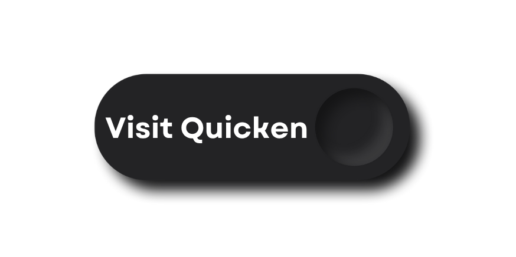

How to Download Quicken After Purchase – Complete Activation Guide for Existing Users
=====================================================================================

Have you recently purchased Quicken and now need to download and activate it? Whether you made your purchase through the official Quicken website, a retail outlet, or a third-party reseller like Amazon or Best Buy, this step-by-step guide will walk you through everything—from logging in to setting up your software correctly on both Windows and Mac.

Quicken is a leading personal finance solution trusted by individuals and small business owners. Whether you're reinstalling it or using it for the first time, this guide will help you download Quicken after purchase, activate it, and begin managing your finances efficiently.

Why Downloading Quicken After Purchase Matters?
-----------------------------------------------

Downloading the right version of Quicken ensures you get all the features tied to your subscription, such as budgeting, investment tracking, bill management, and secure data syncing. If you’ve already bought Quicken, there’s no need to repurchase—just sign in and reinstall it easily from your account.

Start Here – Sign In to Your Quicken Account
--------------------------------------------

Before downloading, ensure you're logged into your Quicken account:

- Visit: https://www.quicken.com/sign-in
- Enter the email address and password used during purchase
- Once logged in, go to **My Account** or **My Downloads**
- You’ll find the download link based on your product and OS

💻 Steps to Download Quicken After Purchase
------------------------------------------

Once logged into your account:

- Visit: https://www.quicken.com/download
- Choose your operating system: Windows or Mac
- Click on **Download**
- Save the file to your device
- Run the installer and follow on-screen instructions

Make sure you're connected to the internet throughout the process for a smooth setup.

Installing Quicken on Windows or Mac
------------------------------------

**For Windows:**

- Double-click the `.exe` file
- Click **Yes** to allow installation
- Follow the guided setup
- Log in using your Quicken ID
- Your subscription will activate automatically

**For Mac:**

- Open the `.dmg` file
- Drag Quicken into the Applications folder
- Launch the app and sign in
- Features unlock based on your active subscription

Real-Time Experience: Setting Up Quicken in Minutes
---------------------------------------------------

    “I recently bought Quicken Deluxe from their website. I logged in at quicken.com/sign-in, 
    downloaded the correct version for Mac, and ran the installer. 
    The entire process—from sign-in to full setup—took less than 10 minutes. 
    I didn’t even need tech support. Just signed in, installed, and got started with budgeting the same evening!”

How to Check Your Subscription Details
--------------------------------------

Not sure which version you purchased or when it expires?

- Log in to: https://www.quicken.com/my-account
- View Order History, Plan Type (Starter, Deluxe, Premier, or Home & Business), and Renewal Status
- Manage billing and subscription renewals easily

Can’t Find the Download Option?
-------------------------------

If the installer isn’t showing up:

- Confirm the email you’re using is the one linked to your purchase
- Search your inbox for Quicken’s purchase confirmation email
- If needed, reach out to support: https://www.quicken.com/support

Troubleshooting Login & Activation Issues
-----------------------------------------

**Login Not Working?**

- Double-check your credentials
- Reset your password if needed
- Clear browser cache or try another browser

**Activation Failed?**

- Ensure your internet connection is active
- Verify your subscription hasn’t expired
- Contact support for help syncing your account

Moving Quicken to a New Computer?
---------------------------------

Planning to switch to a new device?

- Download Quicken on the new PC or Mac
- Restore your backup file (see below)
- Sign in with your Quicken ID
- Your subscription and data will sync automatically

How to Back Up & Restore Quicken Data
-------------------------------------

To avoid losing important financial data:

- Go to `File > Backup and Restore`
- Save the backup to an external drive or cloud storage
- On your new system, use **Restore from Backup**

Use the Quicken Mobile App for On-the-Go Access
-----------------------------------------------

After installing Quicken:

- Download the Quicken Mobile App from App Store or Google Play
- Log in with your Quicken ID
- Your accounts, transactions, and budget data will sync instantly

More info: https://www.quicken.com/mobile

Frequently Asked Questions
--------------------------

**Q: Can I install Quicken on more than one device?**  
A: Yes. It’s intended for single-user access across multiple personal devices.

**Q: What if I bought Quicken from a third party?**  
A: You’ll still need to create a Quicken ID and enter the activation key included with your purchase.

**Q: Do I have to pay again to reinstall?**  
A: No. Reinstallation is free for active subscriptions.

**Q: Is internet required to use Quicken?**  
A: Only for activation and online features. Offline usage is also possible.

**Q: Can I renew or upgrade my plan online?**  
A: Yes. Visit https://www.quicken.com/my-account and select **Renew Now** or update billing.

Conclusion
----------

If you're wondering how to download Quicken after purchase, this complete guide covers everything—from signing in to activating and using the software. You don’t need to repurchase anything. Just log in, download, and you’re ready to manage your finances with confidence.

- Sign in to your account: https://www.quicken.com/sign-in  
- ⬇ Download your product: https://www.quicken.com/download
